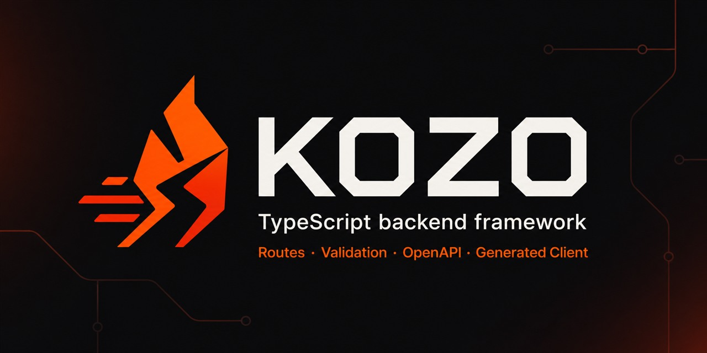

<p align="center">
  
</p>

# Kozo

**A TypeScript backend framework where routes, validation, OpenAPI, generated clients, and tests share one contract.**

[](https://github.com/zazzo9039/kozojs/actions/workflows/ci.yml)
[](https://www.npmjs.com/package/@kozojs/core)
[](./LICENSE)
[](https://kozo-docs.vercel.app)

[Documentation](https://kozo-docs.vercel.app) · [Packages](#packages) · [Examples](./examples) · [Benchmarks](./benchmarks/README.md)

Kozo gives a backend one consistent structure without hiding the underlying platform. Define a route with Zod once and use the same definition for request validation, response serialization, OpenAPI 3.1, a generated TypeScript client, and route-aware tests.

Start with the standard Node.js server, opt into the uWebSockets.js transport when throughput or native WebSockets matter, or run an API and Vite SSR application on one port.

> **Pre-1.0:** Kozo is under active development. Minor releases can contain breaking changes. Pin exact package versions for production deployments and read the [changelog](./CHANGELOG.md) before upgrading.

## Why Kozo?

- **One route contract** — Zod schemas describe request data and public responses.
- **Useful output from the same definition** — runtime validation, OpenAPI, generated clients, and type-safe tests stay aligned with registered routes.
- **A clear default path** — `app.listen()` runs on standard Node.js HTTP with no native dependency.
- **Native performance when you need it** — `app.nativeListen()` registers routes directly with uWebSockets.js.
- **Structure without ceremony** — use programmatic routes or file-system routing with typed services.
- **Transport-aware security** — guards run with the same semantics on the Node and native transports.
- **Focused packages** — add authentication, databases, queues, Redis, and testing without pulling them into the core.

## Quick start

Requirements: Node.js 20.19 or newer.

Create and start a minimal project:

```bash
npx @kozojs/cli my-api --template minimal
cd my-api
pnpm dev
```

Try the generated API:

```bash
curl http://localhost:3000/health
curl http://localhost:3000/hello/Kozo
```

The starter includes a development script, TypeScript configuration, Zod, and the optional native transport. See the [installation guide](https://kozo-docs.vercel.app/docs/getting-started/installation) for npm and manual setup.

### Build an API by hand

```bash
npm install @kozojs/core zod
```

```typescript
import { createKozo, z } from '@kozojs/core';

const app = createKozo();

app.get('/users/:id', {
  params: z.object({ id: z.string().uuid() }),
  response: z.object({
    id: z.string().uuid(),
    name: z.string(),
  }),
}, ({ params }) => ({
  id: params.id,
  name: 'Jane Doe',
}));

app.mountDocs({
  title: 'My API',
  version: '1.0.0',
});

await app.listen(3000);
```

During development, Swagger UI is available at `http://localhost:3000/docs` and the OpenAPI document at `/docs.json`. Documentation routes are disabled by default when `NODE_ENV=production`; enable them explicitly if that is appropriate for your deployment.

## One definition, five jobs

```typescript
import { createKozo, createRouter, z } from '@kozojs/core';

const userRoutes = createRouter()
  .post('/', {
    body: z.object({
      name: z.string().min(2),
      email: z.string().email(),
    }),
    response: z.object({
      id: z.string().uuid(),
      name: z.string(),
      email: z.string().email(),
    }),
  }, async ({ body }) => ({
    id: crypto.randomUUID(),
    ...body,
  }));

const app = createKozo().mount('/users', userRoutes);
```

That route definition provides:

1. Runtime validation for the request body.
2. A public response contract; undeclared object fields are omitted when a compilable response schema is used.
3. An OpenAPI 3.1 operation.
4. A generated route-tree operation such as `api.users.post({ body })`.
5. A type-safe test operation such as `client.users.post({ body })`.

Generate a client from the routes registered in your app:

```typescript
import { writeFile } from 'node:fs/promises';

await writeFile(
  './src/generated/api.ts',
  app.generateClient({ baseUrl: 'https://api.example.com' }),
);
```

Consume the generated contract with the same route shape used in tests:

```typescript
import { createKozoClient } from './src/generated/api.js';

const api = createKozoClient({
  baseUrl: 'https://api.example.com',
});

const result = await api.users.post({
  body: { name: 'Ada', email: 'ada@example.com' },
});

if (result.status === 200) {
  console.log(result.body.id);
}
```

Declared error statuses are returned as typed results rather than thrown.
Statuses outside the generated contract still fail with
`KozoUnexpectedResponseError`. The generated `KozoClient` class keeps the old
flat methods as deprecated migration aliases.

Test the same static route contract without duplicating paths or request types:

```typescript
import { createContractTestClient } from '@kozojs/testing';

const client = createContractTestClient(app);
const response = await client.users.post({
  body: { name: 'Ada', email: 'ada@example.com' },
});

expect(response.status).toBe(200);
```

The contract type is accumulated through returned values. Chain route calls or
mount a `createRouter()` contract. The raw `createTestClient()` remains
available for malformed payloads, unknown paths, and dynamically discovered
file-system routes.

## Programmatic or file-system routing

Programmatic routes keep everything in one module:

```typescript
const apiRoutes = createRouter()
  .get('/health', () => ({ ok: true }))
  .get('/users', () => []);

const app = createKozo().mount('/api', apiRoutes);
```

File-system routing maps files to HTTP methods and paths:

```text
src/routes/
├── health/get.ts              → GET /health
├── users/get.ts               → GET /users
├── users/post.ts              → POST /users
└── users/[id]/get.ts          → GET /users/:id
```

```typescript
// src/index.ts
const app = createKozo({
  routesDir: './src/routes',
  services: { users },
});

await app.loadRoutes();
await app.listen(3000);
```

See [Routing](https://kozo-docs.vercel.app/docs/core/routing), [Context and services](https://kozo-docs.vercel.app/docs/core/context), and the runnable [file-routing example](./examples/file-routing).

## Choose a server mode

The application API stays the same; the deployment method changes.

| Mode | Start method | Best fit | Extra dependency |
|---|---|---|---|
| Node.js HTTP | `app.listen()` | Default development and production path | None |
| uWebSockets.js | `app.nativeListen()` | High throughput and native WebSockets | `uWebSockets.js` from GitHub |
| Vite SSR + API | `app.listenSsr()` | Full-stack applications on one port | `vite` |
| Fetch handler | `app.fetch` | Integrations that accept a Fetch API handler | Runtime-specific adapter |

Install the optional native transport:

```bash
pnpm add uNetworking/uWebSockets.js#v20.66.0
```

Guards created with `app.guard()` run on both Node and native transports. Hono middleware registered with `app.middleware()` remains correct under `nativeListen()`, but covered routes use the Hono bridge instead of the zero-shim native path.

## Packages

| Package | Purpose |
|---|---|
| [`@kozojs/core`](./packages/core/README.md) | Routes, Zod validation, OpenAPI, client generation, transports, SSR, and WebSockets |
| [`@kozojs/cli`](./packages/cli/README.md) | Project templates, development commands, route discovery, and code generation |
| [`@kozojs/auth`](./packages/auth/README.md) | JWT verification and role-based guards |
| [`@kozojs/db`](./packages/db/README.md) | Drizzle integration for PostgreSQL, SQLite, and MySQL connections |
| [`@kozojs/queue`](./packages/queue/README.md) | Unified BullMQ and AMQP job queue adapters |
| [`@kozojs/redis`](./packages/redis/README.md) | Cache, pub/sub, and distributed rate-limit storage |
| [`@kozojs/testing`](./packages/testing/README.md) | Route-derived contract tests, raw injection, and real native-transport clients |

Install only the packages your application needs. Each package README documents its peer dependencies, supported backends, and lifecycle behavior.

## Documentation

Start here:

- [Installation](https://kozo-docs.vercel.app/docs/getting-started/installation)
- [Five-minute quick start](https://kozo-docs.vercel.app/docs/getting-started/quick-start)
- [Project structure](https://kozo-docs.vercel.app/docs/getting-started/project-structure)
- [Routing](https://kozo-docs.vercel.app/docs/core/routing)
- [Validation and response contracts](https://kozo-docs.vercel.app/docs/core/validation)
- [OpenAPI](https://kozo-docs.vercel.app/docs/core/openapi)
- [Authentication guards](https://kozo-docs.vercel.app/docs/packages/auth)
- [Testing](https://kozo-docs.vercel.app/docs/packages/testing)
- [Common pitfalls](https://kozo-docs.vercel.app/docs/guides/common-pitfalls)

The repository also contains versioned Markdown guides in [`docs/`](./docs/README.md), runnable examples in [`examples/`](./examples), and detailed benchmark methodology in [`benchmarks/`](./benchmarks/README.md).

## Performance

Kozo's native transport is designed to keep routing and schema work out of the request hot path. In the repository's benchmark snapshot, the native Kozo fixture tracks the included bare-uWS fixture and exceeds the included Fastify and NestJS fixtures.

Those numbers are synthetic, hardware-dependent measurements—not an application capacity promise. Review the [results](./benchmarks/RESULTS.md), [methodology](./benchmarks/METHODOLOGY.md), and fixtures before drawing conclusions, and benchmark your own workload.

## Development

```bash
pnpm install
pnpm build
pnpm typecheck
pnpm test
```

Contributions are welcome. Read [CONTRIBUTING.md](./CONTRIBUTING.md), report vulnerabilities through [SECURITY.md](./SECURITY.md), and use the [issue tracker](https://github.com/zazzo9039/kozojs/issues) for reproducible bugs and proposals.

## License

[MIT](./LICENSE) © Kozo Team
